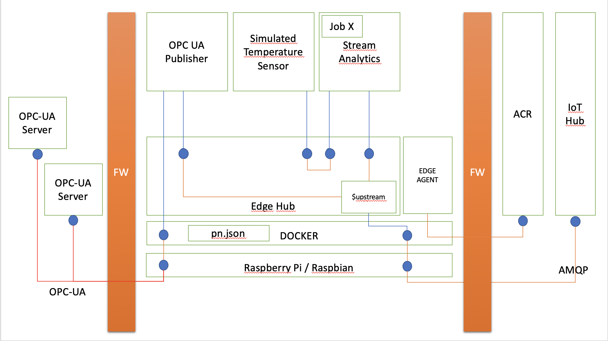
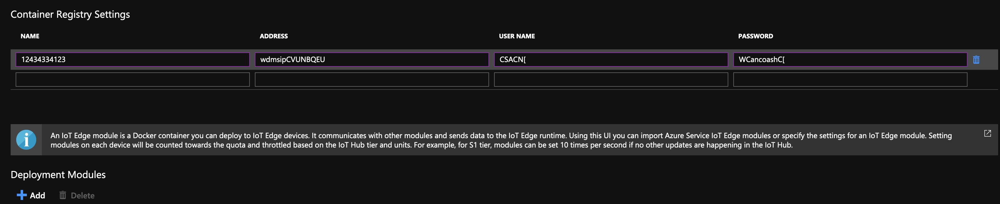

# LAB 5: Module Authoring  

We have now quite an interesting micro services architecture in our Edge Device. It looks like:



As You notice, the PLC is sending data in 1000 ms interval, and we are sending data to IoT Hub every 5 seconds (as per our config file). That means that we are sending an array of values to IoT Hub. 
```
[
    
    {
        "NodeId": "ns=1;s=020",
        "DisplayName": "Max Driver RPM",
        "Value": {
            "Value": 26.411371297004273,
            "SourceTimestamp": "2019-05-11T06:39:14.4652272Z"
        }
    },
    {
        "NodeId": "ns=1;s=040",
        "DisplayName": "Pressure Alarm On",
        "Value": {
            "Value": false,
            "SourceTimestamp": "2019-05-11T06:39:19.4715840Z"
        }
    }
]
```

Your task now is to create a module that looks into the sampling array above and send to IoT Hub the following payload:

```
[
  {
    "NodeId": "ns=1;s=020",
    "Value": <THE AVERAGE OF ALL READINGS FOR THIS TAG IN THIS ARRAY>
  }
]
```

This LAB will give you instructions to either:

1. You will be able to either write your own code or to use code that is ready for you.
   You can of course choose any other SDK you are more familiar with. You can find instructions for different languages [here](https://docs.microsoft.com/en-us/azure/iot-edge/tutorial-develop-for-linux).  
   Just select your favorite language from bullet point 2.  
   If You choose to do that, proceed to [LAB 5.1](https://github.com/lucarv/connfac-lab/tree/master/LAB%205/LAB%205.1).

2. Download a ready module from an external repo.  
If You choose to do that, proceed to [LAB 5.2](https://github.com/lucarv/connfac-lab/tree/master/LAB%205/LAB%205.2)   

## Create a new manifest

You can now go back to the portal and add the new module to the deployment manifest.
Remember that modules are not **PUSHED** to the edge device. The Edge device **PULLS** it from the registry, and therefore you must add the registry information to the manifest, as shown in the image below:



If you created your own module, use the credentials for your container registry.  
If you are using a ready made module, ask your proctor for redentials.  

Proceed by adding this module to the manifest as we have done before (nmae it formatter), then create your Route as below
``` 
{
    "routes": {
      <YOUR EXISTING ROUTES>
      , "formatterToCloud": "FROM /messages/modules/formatter/* INTO $upstream"
      , "publisherToFormatter": "FROM /messages/modules/publisher/* INTO BrokeredEndpoint(\"/modules/formatter/inputs/input1\")",

    }
}
```
and push it to the Edge Module.

## View generated data

You can view the status of your IoT Edge device using the Azure IoT Hub Devices section of the Visual Studio Code explorer. Expand the details of your device to see a list of deployed and running modules.

[NEXT LAB](https://github.com/lucarv/connfac-lab/tree/master/LAB%206)
