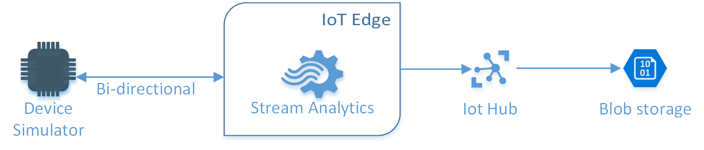
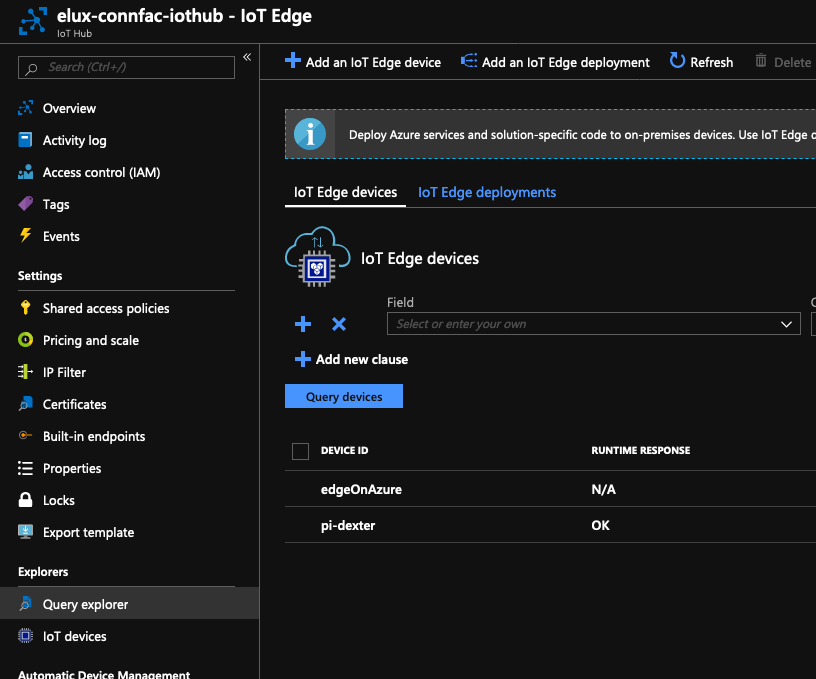
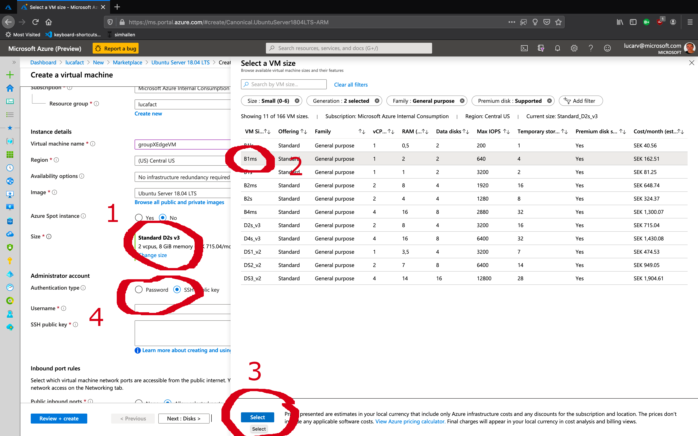
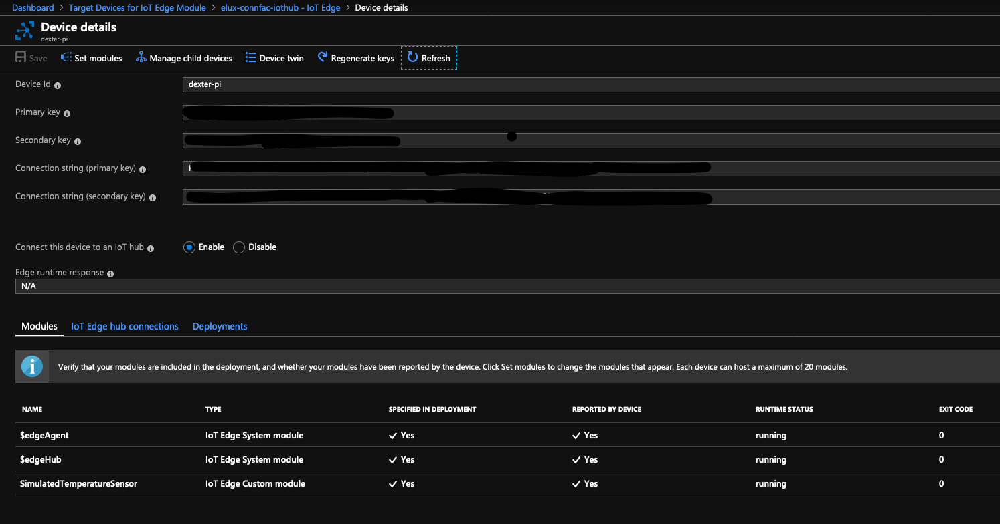
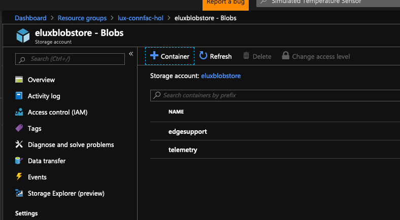
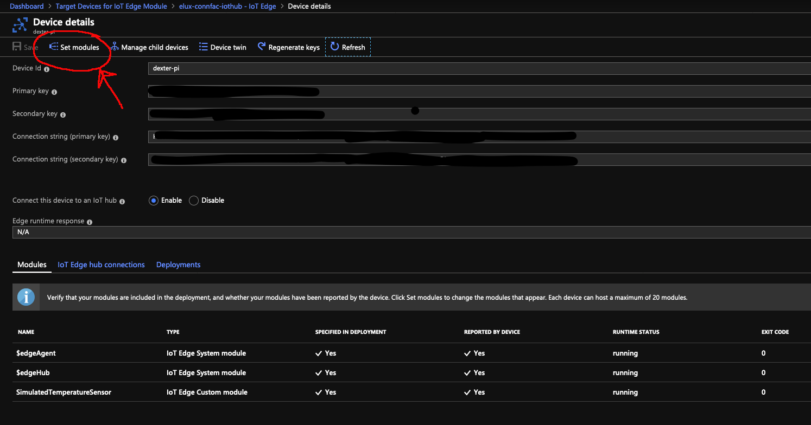
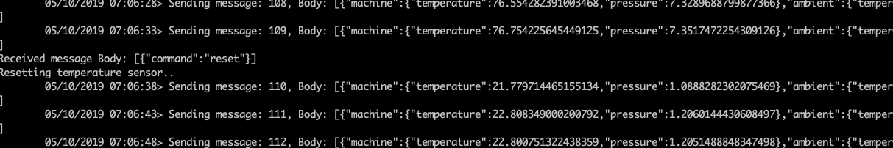

# Edge Intelligence 

  

## Part 1: Provision an Azure Edge Device  

First we will pre-provision an EDGE device identity in IoT Hub (look for IoT Edge on the IoT Hub left side menu), using symmetric keys generated by Azure (Note that this is not a best practice for production, we will do it for educational purposes only)  




### Prepare the device  

In this lab we will be preferrably deploying an edge device on:  

- OPTION 1: a Raspberry Pi 3 running stretch. IoT Edge is not supported on Buster
- OPTION 2: a VM on Azure unning Linux. If you follow this, please go to the Azure Portal search for Ubuntu 18.04. Deploy a new VM, making sure you select a smaller HW profile, and login with username and password, as shown below, then press **Review + Create**  



Connect to the device via ssh (or putty if you are on a Windows PC).  

### Add the Microsoft Repository for Edge SW  

```
curl https://packages.microsoft.com/config/ubuntu/18.04/multiarch/prod.list > ./microsoft-prod.list  
sudo cp ./microsoft-prod.list /etc/apt/sources.list.d/
curl https://packages.microsoft.com/keys/microsoft.asc | gpg --dearmor > microsoft.gpg
sudo cp ./microsoft.gpg /etc/apt/trusted.gpg.d/
sudo apt-get update
```

### Download and install the container engine

```
sudo apt-get install moby-engine moby-cli -y
```

### Download and install the IoT Edge Security Daemon

```
sudo apt-get install iotedge
```

## Manage the device on Azure  

At this point we are ready to connect the Edge Device to the Cloud. We need to provision the symmetric key to the device and for this lab we will do it manually by editing the Edge config file and pasting the Edge connection string we provisioned earlier in this lab:   
```
> sudo nano /etc/iotedge/config.yaml  
```

Once you have done it, reboot the security daemon by running the following command on the terminal:  
```
> systemctl restart iotedge
```

## Part 2. Generate data

You can verify that the Edge Device is ready to be further configured by means of a deployment manifest. A manifest is a json document containing modules and pipelines.
Modules can be downloaded from any docker repository, and some of them are available at the Edge Market place on the Azure Portal. We will fetch a module that will simulate a device sending telemetry.  

To deploy your first module from the Azure Marketplace, use the following steps:  

1. In the Azure portal, enter Simulated Temperature Sensor into the search and open the Marketplace result.
2. Choose an IoT Edge device to receive this module. On the Target Devices for IoT Edge Module page, provide the appropriate info. Select "Create". This will take you back to the device pane on the portal, it will show the module in the list of deployment modules.
3. We will only deploy one module now, so press "Next" to configure the pipeline. 
4. For now, you want all messages from all modules to go to IoT Hub ($upstream). It's  autopopulated, just select "Next"
5. The next pane will show you the deployment manifest. Take a minute to inspect the JSON file. Then press "Submit". The deployment manifest is then sent to the edge device, while the Portal will take you back to your device list pane.
6. Select your device, check that the modules were deployed correctly



### View generated data

In this quickstart, you created a new IoT Edge device and installed the IoT Edge runtime on it. Then, you used the Azure portal to push an IoT Edge module to run on the device without having to make changes to the device itself. In this case, the module that you pushed creates environmental data that you can use for the tutorials. 

Open the command prompt on the computer running your simulated device again. Confirm that the module deployed from the cloud is running on your IoT Edge device. View the messages being sent from the tempSensor module to the cloud:
> sudo iotedge logs -f SimulatedTemperatureSensor  

You can also verify the D2C messages using the device explorer or visual code.

## Part 3. Create a Stream Analytics job

Instead of sending every single reading from the device, let's save connectivity costs by only send averages. We will also want to repeat the behaviour of the previous lab, where we will reset the device once the temperature reach a threshold. 
First we need to create a container to store the jobs that will be sent to the edge. 



### Create a new job

In the Azure portal, go to Create a resource > Internet of Things > Stream Analytics Job. W have already done this once, the difference is that now we will choose "Edge" as Hosting environment. As before, we need to configure an input, a query and an output. In the Edge case both input and output will be Edge Hub (for reasons that should be clear to us now). Note that the name of your input and output are important, as they need to match the entry points in your modules. Let's call the input temperature and the output alert.

For the query, we will replace the default quesry with the following query:
```
SELECT  
    'reset' AS command 
INTO 
   alert
FROM 
   temperature TIMESTAMP BY timeCreated 
GROUP BY TumblingWindow(second,30) 
HAVING Avg(machine.temperature) > 70
```
Save the job. We also need to store the job in the container we created above. Choose "Storage account settings" on the Configure Menu.

### Deploy the job

You are now ready to deploy the Azure Stream Analytics job on your IoT Edge device.

In this section, you use the Set Modules wizard in the Azure portal to create a new deployment manifest. We have already deployed a temperature simulator. We will now add your Stream Analytics job. We will then create a pipeline that will connect these together and further to the cloud.

1. In the Azure portal, in your IoT hub, go to IoT Edge, and then open the details page for your IoT Edge device.  Click on Set modules.



2. Click Add and select Azure Stream Analytics Module.
3. Select your subscription and the Azure Stream Analytics Edge job that you created.
4. Select Save.
5. Make a note of the name of your Stream Analytics module because you'll need it in the next step, then select Next to continue.
6. Replace the default value in Routes with the following code. Update all three instances of {moduleName} with the name of your Azure Stream Analytics module.

``` 
{
    "routes": {
        "alertsToCloud": "FROM /messages/modules/{moduleName}/* INTO $upstream",
        "alertsToReset": "FROM /messages/modules/{moduleName}/* INTO BrokeredEndpoint(\"/modules/SimulatedTemperatureSensor/inputs/control\")",
        "telemetryToAsa": "FROM /messages/modules/SimulatedTemperatureSensor/* INTO BrokeredEndpoint(\"/modules/{moduleName}/inputs/temperature\")"
    }
}
```

7. The routes that you declare here define the flow of data through the IoT Edge device. The telemetry data from the SimulatedTemperatureSensor module are sent to IoT Hub and to the temperature input that was configured in the Stream Analytics job. The alert output messages are sent to IoT Hub and to the tempSensor module to trigger the reset command.
8. Select Next.
9. In the Review Deployment step, select Submit.
10.  Return to the device details page, and then select Refresh. Check that all modules are up and running  
11. Monitor the messages being sent from the SimultaedTemperatureSensor module
> sudo iotedge logs -f SimulatedTemperatureSensor  
12. Verify that after the temperature reaches the threshold, the Sensor is reset





[NEXT LAB](../iiot)
