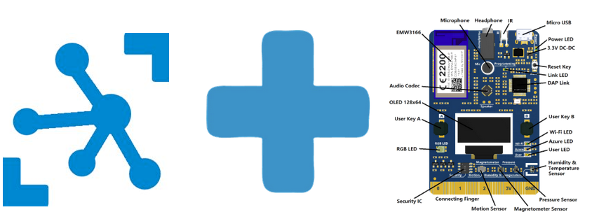
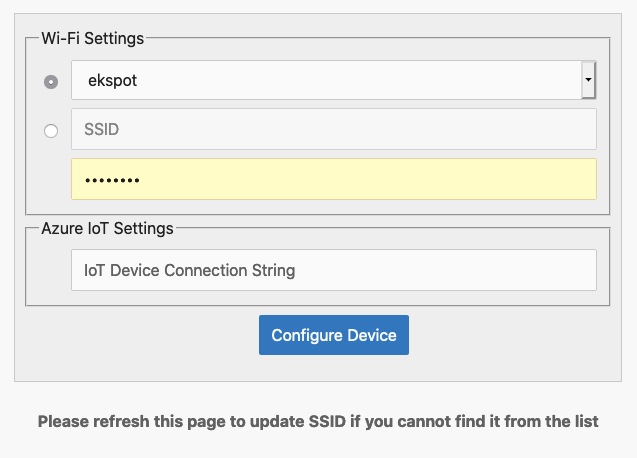

# IOT HUB  

  
  

For this lab we will monitor measurements coming from the MXChip to an IoT Hub, save the messages to blob storage and report back to the device via an Azure Function if the device measurement falls beyond a threshold.  


## Create IoT Hub  

## Manually Provision a device  
 
## Provision the DevKit device

1. We need to have the proper FW on the device. We might need to do a quick FW update on your new mxchip. The FW can be found [here](https://github.com/microsoft/devkit-sdk/releases/download/1.6.5-release/devkit-getstarted-1.6.5.bin). Do this if your mxchip display shows somethint differnet from:   
```
    IoT DevKit - AP
    Az-cxxxx...  
    Configuration
    192.168.0.1  
```  
2. Connect the DevKit device to your development machine using a USB cable. In Windows, a file explorer window opens on a drive mapped to the storage on the DevKit device. For example, the drive might be called AZ3166 (D:).
4. Drag the FW .bin file onto the drive window. When the copying is complete, the device reboots with the new firmware.  
Press (and hold) the B button. Press and hold for 3 seconds then release the reset button. Release the B buton. See that the screen displays: 
5. The device is now in access point (AP) mode. You can connect to this WiFi access point (AZ-cxxxx...) from your computer or mobile device. 
6. On your computer, phone, or tablet connect to the WiFi network name shown on the screen of the device. When you connect to this network, you don’t have internet access. This state is expected, and you’re only connected to this network for a short time while you configure the device.
7. Open your web browser and navigate to http://192.168.0.1. The following web page displays: 

   

8. Enter the data for the **wifi** we will be using in the lab.
9. The **Azure IoT Settings** will be the connection string of the device we created earlier in this lab. Paste that into the window and press _Configure Device_  
    NOTE: You need to do this using the Edge browser. The katest versions of the FW are somewaht buggy and will not work with Chrome Firefox or Safari.
9. A successfull configuration should get the device to reboot and start to send telemetry to IoT Hub.

## Verify the telemetry
Note that while the device has many sensors, the current sample only sends temperature and humidity to the cloud. You can quickly chage these vaues by blowing hot air with your mouth on the bottom right corner of the device, where the sensor is ;)


[NEXT lab](../lab24)

