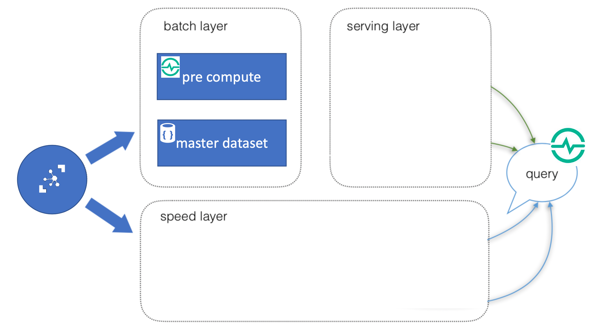
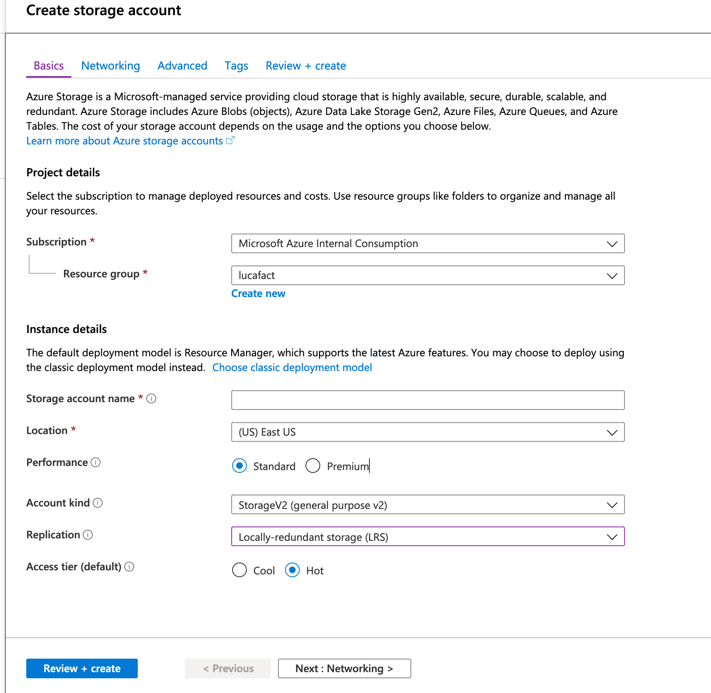
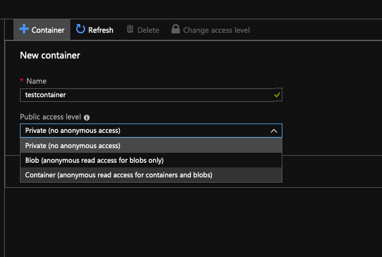
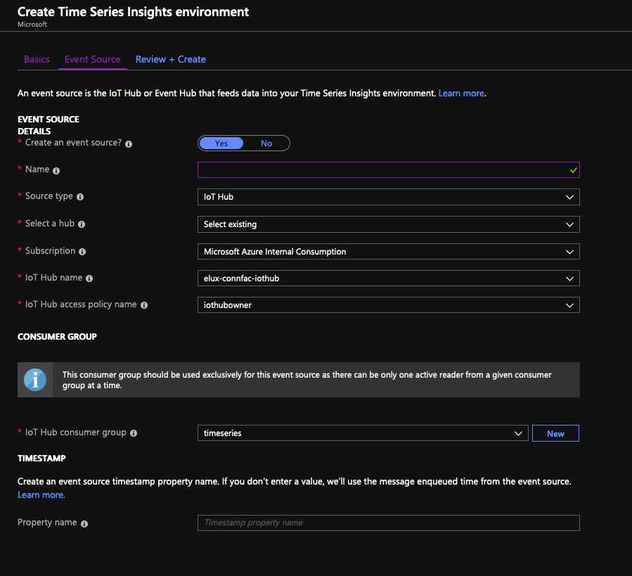

# LAB 2.1: Lambda Architecture Batch Layer  

In LAB 1 we have explored IoT Hub, which is Azure's IoT Cloud Ingestion Service. As we have learned, IoT Hub is a message queue with routing capabilities, and so far we have received telemetry and have not done anything with it. We will now add to our lambda architecture by creating a batch layer.  
(Note that this is a very simplified batch layer, with very rudimentsr pre-compute and storage for the master dataset)  

## Create Blob storage

1. Select your Resource group and then click the "+ Add" button to add a Storage Account
2. Search for Storage Account and then click “Create”
3. Select the subscription, Resource Group and Region
4. Give it a unique name. A Storage Account is fully addressable from the public internet!!!
6. Leave everything else with default settings
7. Press “Review + create“  
8. Verify the settings and press “Create“

9. When the resource is created, go to it
10. On the landing blade, Select Blobs
11. Create a Container by Pressing the appropriate Button. Give it a name and select "Container" as Public Access level

### Create a route to storage  

IoT Hub works by declarative routing, and so far we have used the default route. We will now create a new route to send telemetry from sensors to the cold storage.

1. Go back to your IoT Hub
2. Select "Message Routing". Choose the "Custom endpoints" tab.
3. Create a new Custom endpoint. Press "+ Add" and choose Blob Storage from the drop down menu. Give the end point a name and pick the container we have created. Select "Create"
4. Enter the Routes tab and press "+ Add". Give your route a name, select your blob as endpoint. Leave the rest as per default values. Press "Save".
5. Once the route is activated, you may notice that the telemetry is no longer showing (oin VS Code). Can You think of the reason for that?
7. Wait a little and verify that the blob has now telemetry stored.

One drawback from using message routing in IoT Hub is that once a rule is matched, the telemetry is removed from the queue and can't be consumed by other applications. There are ways around this but for now let's just disable the route on the Portal.  

## Create Time Series Insights

Let's create a Time Series Insights , which is a tool that is very much appreciated by Operations teams in manufacturing. This tool behaves very much like a cloud historian, with the added bonus of a very useful UI. It is built on top of Azure Data Explorer, which we will explore (pun intended) further later...

1. On the Portal, search for Time Series Insights
2. Choose an environment name, your subscription, the resource group we are using and the same location
3. Press "Next: Event Source"
4. Give it a name, leave IoT Hub as source type, select your IoT Hub, and use the iothubowner policy name
5. Choose the consumer group timeseries that we created in LAB 1.

1. Once the provisioning is ready, select it and choose "Go to Environment" (top of Portal page)
2. As a default, TSI will display a graph for the event as a counter (not super useful)
3. Let's choose a relevant, input. Choose from the dropdown.
4. Let's add more inputs.  
5. Choose from the dropdown
6. Observe the Time Series graphs and heat maps.  

[NEXT LAB](../lab22)  

